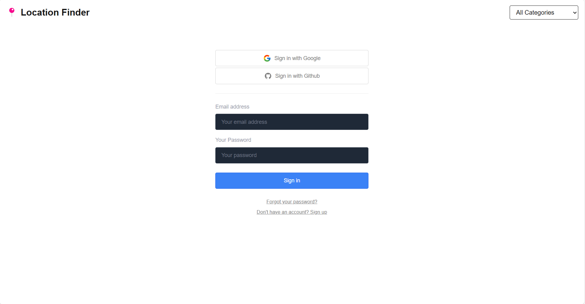
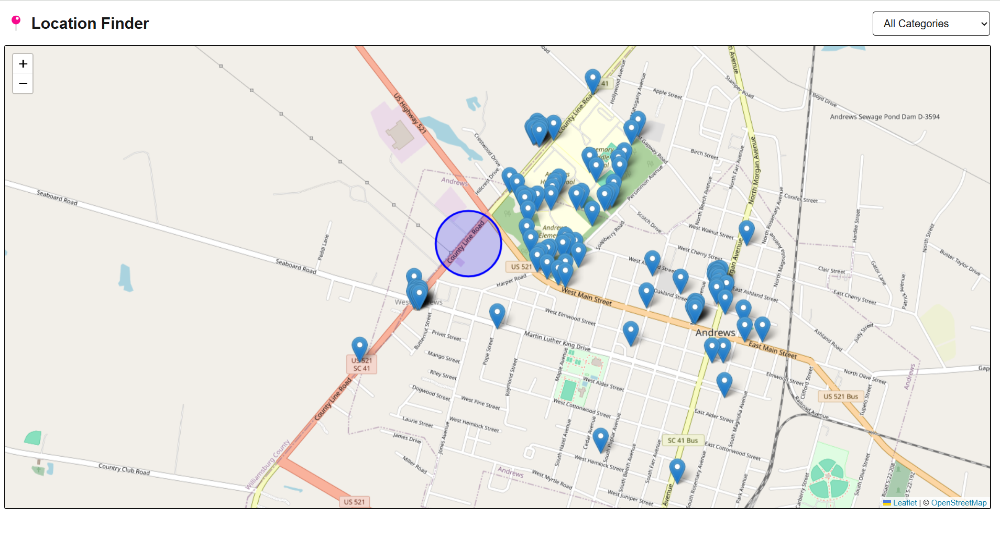
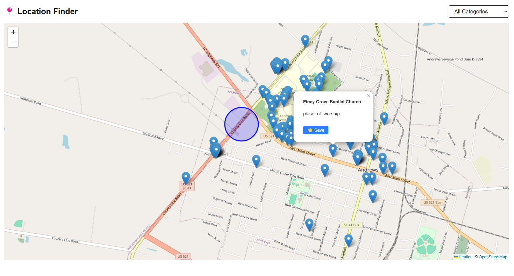
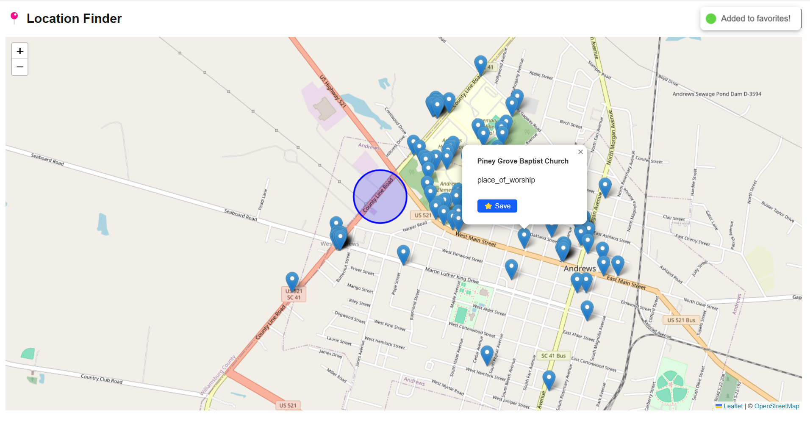

# 📍 Location Finder
 A Next.js web application that helps users discover various points of interest around them using OpenStreetMap + React Leaflet.


## 🚀 Features
✅ Interactive Map – Explore locations using React Leaflet and OpenStreetMap
✅ Real-time Geolocation – Detects and displays the user's live location
✅ Category-Based Filtering – Find restaurants, parks, hospitals, and more
✅ User Authentication – Secure sign-up/login with Supabase
✅ Save Favorite Locations – Bookmark places for easy access
✅ Dark Mode Support – Seamless UI experience in light/dark themes

## 🛠️ Tech Stack
- Frontend: Next.js, React, TypeScript, Tailwind CSS

- Maps: OpenStreetMap, React Leaflet

- Authentication & Database: Supabase

- Geolocation API: Browser-based location tracking

## Installation & Setup
### Clone the Repository
```bash
git clone https://github.com/rampalliprakhar/location-finder.git
cd location-finder
```

### Install Dependencies
```bash
npm install
```

### Set Up Environment Variables
#### Create a .env.local file and add your Supabase keys:

```bash
NEXT_PUBLIC_SUPABASE_URL=your_supabase_url
NEXT_PUBLIC_SUPABASE_ANON_KEY=your_supabase_anon_key
```

### Start the Development Server
```bash
npm run dev
Open http://localhost:3000 in your browser.
```

## How It Works
- User signs in with Supabase authentication.

- Map loads using OpenStreetMap and detects user location.

- Users filter locations based on categories (restaurants, parks, etc.).

- Users can save favorite places for quick access later.

## Screenshots
- Location tracing:


- Place details:


- Add to favorites:


## Future Improvements
- 📍 Live Traffic Data

- 🗺️ Custom Map Themes

- 🏷 User Reviews & Ratings

- 🔍 Advanced Search with Auto-Complete